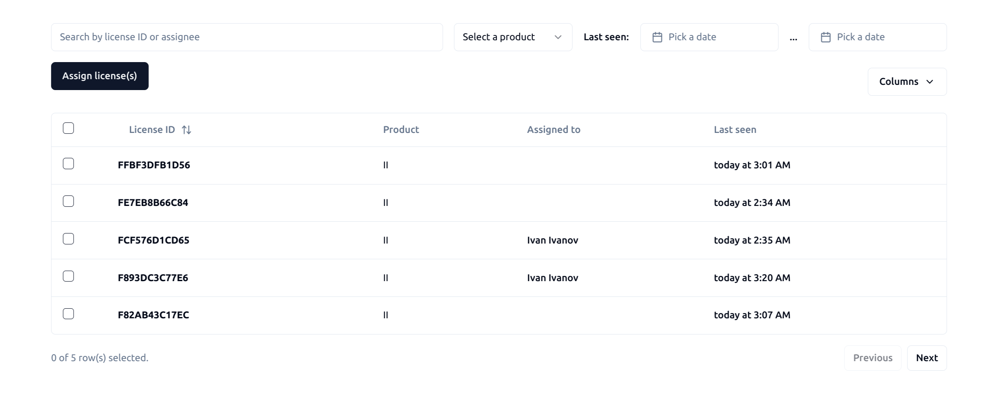

## Тестовое задание: список лицензий

Необходимо реализовать компонент для отображения таблицы `<Table/>` со следующим функционалом:

- Серверная паджинация: данные таблицы считываются с сервера постранично (query parameter: `?pageIndex=0&pageSize=10`, общее число элементов возвращается в заголовке `X-Total-Count`)
- Клиентская паджинация (допускается реализация отдельным компонентом)
- Сортировка по одной колонке (query parameter: `?sortBy=-lastSeen`, для смены направления сортировки использовать префикс `+/-`)
- Поиск/фильтрация данных (query parameter: `?product=II&lastSeenGe=2023-01-01T00%3A00%3A00%2B03%3A00&search=1234`)
- Позиция в таблице, сортировка, поиск и фильтр должны сохранятся в query параметрах страницы, перезагрузка 
  страницы или открытие ссылки в другом браузере должны восстанавливать состояние таблицы
- Изменения порядка следования колонок перетаскиванием мышки (состояние должно сохранятся при перезагрузке страницы)
- Возможность скрывать колонки (состояние должно сохранятся при перезагрузке страницы)

Помимо компонента таблицы необходимо реализовать компонент `<Dialog/>`:

- Кнопка `Assign license(s)` должна открывать диалог с возможностью указать кому назначаются выбранные лицензии. 

Задание должно быть выполнено на TypeScript c использованием React. При выполнении задания нельзя использовать библиотеки для работы с таблицами и диалогами. 
На любые другие библиотеки ограничений нет. 

Мы ожидаем качество кода уровня production, то есть то, что вы бы готовы были отдать конечным пользователям.

## API

Для запуска сервера:

> cd server && yarn && yarn start:dev

OpenApi спецификация доступна по адресу http://localhost:3000/api-yaml 

Если в работе сервера обнаружаться ошибки, то можно писать в телеграм @alex_burkov (так же задавать туда любые вопросы по заданию)
